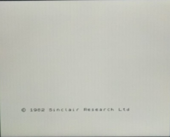

# ZX48 DECA port (VGA version)

DECA top level by Somhic adapted from Kyp's ua2 port https://github.com/Kyp069/zx48 (video part from zxuno port).

**Now compatible with [Deca Retro Cape 2](https://github.com/somhi/DECA_retro_cape_2)** (new location for 3 pins of old SDRAM modules). Otherwise see pinout below to connect everything through GPIOs.

**Features:**

* VGA video output is available through GPIO.  Tested with PS2 & R2R VGA adapter (333)  https://www.waveshare.com/vga-ps2-board.htm
* Line out audio output (3.5 jack green connector)
* Supports EAR for loading tap files though the line in jack audio connector (3.5 jack blue connector)

* Joystick available through GPIO .  **Joystick power pin must be 2.5 V**. 
  * **DANGER: Connecting power pin of DB9 above 2.6 V may damage the FPGA**
  * This core is prepared for Megadrive 6 button gamepads as it outputs a permanent high level on pin 7 of DB9

**Additional hardware required**:

- SDRAM module. Tested with 32 MB SDRAM board for MiSTer (extra slim) XS_2.2 ([see connections](https://github.com/SoCFPGA-learning/DECA/tree/main/Projects/sdram_mister_deca)).
- PS/2 Keyboard connected to GPIO. See connections below

**Initial screen:**

**Important notes:**

* **If it starts with black screen press space + F12 to perform a hard reset**
* By default video output is VGA. Pressing Scroll Lock key toggles to RBG output.
* **It is needed an SDcard with esxdos 0.89** (bin and sys folders)

VGA / HDMI file changes:  VGA and HDMI versions differ in the following files src/main.v, src/video.v, deca/zx48.qsf, deca/zx48.sv

**Versions**:

- current version: 5.0
- see changelog in top level file /deca/zx48.sv

**Compiling:**

* Load project from /deca/zx48.qpf

* sof/svf files already included in /deca/output_files/

**Pinout connections:**

In this core PWM audio-l/r, UART, MIDI, and VGA-R/G/B[0] are not connected.

**Others:**

* Button KEY0 is a reset button

### STATUS

* Working fine

  

Follows original readme.md

<h3>ZX48, a Sinclair ZX Spectrum 48K FPGA implementation</h3>

Supports this FPGA boards:

<ul>
<li>ZX-Uno (<a href="http://zxuno.speccy.org/">http://zxuno.speccy.org/</a>)</li>
<li>ZXDOS and ZXDOS+ (<a href="https://www.antoniovillena.es/store/">https://www.antoniovillena.es/store/</a>)</li>
<li>MiST (<a href="https://github.com/mist-devel/mist-board/wiki)">https://github.com/mist-devel/mist-board/wiki</a>)</li>
<li>SiDi (<a href="https://manuferhi.com/p/sidi">https://manuferhi.com/p/sidi</a>)</li>
<li>UnAmiga Reloaded (<a href="https://github.com/UnAmigaReloaded-fpga)">https://github.com/UnAmigaReloaded-fpga</a>)</li>
</ul>

Implements a standard ZX Spectrum 48K computer and the follwing hardware:

<ul>
<li>DivMMC (esxdos 0.8.9)</li>
<li>Specdrum</li>
<li>Turbosound</li>
<li>SA1099 (MiST, SiDi, UnAmiga)</li>
<li>Joystick Kempston</li>
<li>Tape loading</li>
</ul>

Keyboard shortcuts

<ul>
<li>Spectrum Reset: F12 or Ctrl+Alt+Del (ZX-Uno, ZXDOS, ZXDOS+)</li>
<li>Spectrum Reset: F6 or Ctrl+Alt+Del (MiST, SiDi, UnAmiga)</li>
<li>FPGA Reset: F11 or Ctrl+Alt+Backspace (ZX-Uno, ZXDOS, ZXDOS+)</li>
<li>NMI: F5</li>
<li>Toggle RGB/VGA: scroll lock</li>
</ul>

